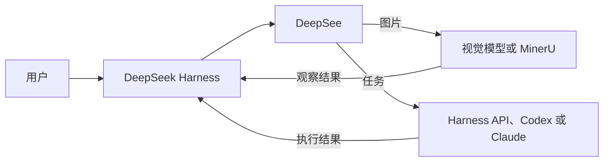

<h1 align="center">深见 DeepSee</h1>

<p align="center"><strong>让 DeepSeek Harness 看见，也让合适的模型做合适的事。</strong></p>

<p align="center">
  <a href="README.md">English</a> ·
  <a href="README.zh-CN.md">简体中文</a>
</p>

<p align="center">
  
  
  
</p>

DeepSee 是 [DeepSeek Harness](https://github.com/deepseek-ai/DeepSeek-Harness) 的轻量插件。它给纯文本 DeepSeek 模型补上一条真正可用的视觉路线，把电脑上已有的模型整理成可调用的目录，并在 Workflow 中把任务交给更合适的执行者。

它不会另造一套产品：仍然使用原来的 Web 界面、模型设置，以及 Harness 自带的 Loop、Goal、Plan 和 Workflow。没有第二个控制台，没有伴随服务，也不需要重复填写 API Key。

> [!IMPORTANT]
> DeepSee 目前处于 Alpha 阶段，目标版本为 DeepSeek Harness `0.1.0-rc.6`。视觉路线、模型目录、Codex/Claude 桌面端与 CLI 适配、一键安装与升级流程已经实现；Runtime 支持会保持谨慎，真实边界见下文。

## 一行安装

电脑需要 [Node.js 24 或更高版本](https://nodejs.org/)。在 PowerShell 或终端中运行：

```powershell
npx --yes github:WUBING2023/deepsee install
```

然后启动 Harness Web 界面：

```powershell
npx --yes github:WUBING2023/deepsee web
```

打开 [http://127.0.0.1:3080/](http://127.0.0.1:3080/)，侧栏中会出现原生风格的 DeepSee 面板。

如果你已经配置过 DeepSeek Harness，DeepSee 会直接复用已有供应商、模型 ID 和凭据引用。添加或修改 API 模型仍在 Harness 原生的 **设置 → 模型** 页面完成，插件不会要求你再保存一遍 Key。

[首次使用指南 →](docs/GETTING_STARTED.zh-CN.md) · [English guide →](docs/GETTING_STARTED.md)

## DeepSee 增加了什么

| 能力 | 实际体验 |
| --- | --- |
| **真正可执行的识图** | 上传图片后，DeepSee 会交给选定的多模态模型或 MinerU OCR，再把观察结果交回 DeepSeek。对话中会标明真正的视觉读取者。 |
| **统一模型目录** | Harness API 模型与通过验证的本地 CLI 会出现在同一个简洁矩阵中，显示可用性和擅长能力。 |
| **快速初始化** | 自动选择首个可用视觉模型，并沿用 Codex/Claude 桌面端或 CLI 与已有 `AGENTS.md`、`CLAUDE.md` 或 `agent.md` 指令。 |
| **原生配置体验** | 插件就在 Harness 侧栏内，通过同源接口工作；模型和凭据仍归 Harness 管理。 |

### 视觉：模型或 OCR

在 DeepSee 首选项中选择一种读取方式：

- **模型**：选择 Harness 中确认支持图片输入的模型。
- **OCR**：使用 MinerU 读取文档文字与版面。安装时会显示简单的阶段进度条，并按需尝试已有环境、`uv`、Python + `venv`、校验过的便携 UV，最后再尝试源码 ZIP。

视觉路线完成读取后，DeepSeek 会拿到观察结果并继续正常对话。纯文本模型不会再被界面伪装成“已经看过图片”。

### 模型目录与本地 Runtime

DeepSee 在启动时扫描本机，只让真正通过执行、登录和适配验证的路线保持可用。能力描述可以通过一条很短的模型请求自动生成，也可以由用户修正。

| 路线 | 可发现 | 可由 DeepSee 执行 | 说明 |
| --- | :---: | :---: | --- |
| Harness / API 模型 | 是 | 是 | 复用原生供应商、模型设置和子 Agent。 |
| Codex Desktop / CLI | 是 | 是 | 复用验证通过的内置 App Server 或 CLI，可选择支持的模型档位。 |
| Claude Desktop + Claude Code | 是 | CLI 验证后可用 | 只有桌面端时可从 DeepSee 打开；自动 Workflow 仍需要 Claude Code CLI。 |
| Kimi CLI、OpenCode、Ollama | 是 | 暂不支持 | 会如实显示扫描结果；没有稳定 Harness 适配器时不会伪装成可执行路线。 |
| MinerU | 是 | 仅 OCR | 位于首选项中的视觉工具，不混入通用模型矩阵。 |

### Workflow 与 Prime

- `/workflow <任务>` 会显式启动一个可见的 Harness Workflow。
- Prime 会让小任务继续走普通 Loop；只有确实存在独立工作流、跨能力角色，或已经批准的 Workflow 计划时才进入编排。
- Harness/API 模型通过原生 `spawn` 子 Agent 执行；Codex 与 Claude Code 通过各自验证过的 CLI provider 执行。
- `opends_list_models` 工具让主模型按视觉、编码、写作、推理、文档或审查能力查看可用路线。



## 保持轻量的设计

- 以标准 DSH bundle 安装到 `web` 与 `headless` 两个 profile。
- 配置接口挂载在同源 `/api/deepsee`；没有 `3091` 端口，也没有第二个 Node.js 进程。
- 可变状态保存在 `$DSH_HOME/deepsee`，与包目录分离，升级和卸载不会抹掉用户选择。
- `prime` preset 从当前 Harness 的标准 preset 生成，不修改官方 preset。
- 只读取供应商元数据和凭据引用，不读取原始 API Key。

[查看架构与扩展点 →](docs/ARCHITECTURE.zh-CN.md)

## 常用命令

```powershell
npx --yes github:WUBING2023/deepsee install    # 安装或安全续装 Web + Headless
npx --yes github:WUBING2023/deepsee web        # 启动 Harness Web 界面
npx --yes github:WUBING2023/deepsee doctor     # 检查插件、Runtime 与配置
npx --yes github:WUBING2023/deepsee uninstall  # 卸载插件并保留用户状态
```

版本检查会低频自动进行，但安装升级一定需要用户在 DeepSee 面板中点击确认。升级器锁定不可变的 Git commit，安装前验证包，并可续跑只完成了一个 profile 的升级。面板显示 **重启生效** 后，再重启 Harness。

如果一行安装超时，请使用[压缩包兜底安装](docs/GETTING_STARTED.zh-CN.md#压缩包兜底安装)。Runtime、识图或升级异常可查看[排障指南](docs/TROUBLESHOOTING.zh-CN.md)。

## 文档

| 指南 | 简体中文 | English |
| --- | --- | --- |
| 安装与首次运行 | [快速上手](docs/GETTING_STARTED.zh-CN.md) | [Getting started](docs/GETTING_STARTED.md) |
| 架构与扩展 | [架构说明](docs/ARCHITECTURE.zh-CN.md) | [Architecture](docs/ARCHITECTURE.md) |
| 诊断与恢复 | [排障指南](docs/TROUBLESHOOTING.zh-CN.md) | [Troubleshooting](docs/TROUBLESHOOTING.md) |
| 本地开发 | [参与开发](CONTRIBUTING.zh-CN.md) | [Contributing](CONTRIBUTING.md) |

## 本地开发

```powershell
pnpm install
pnpm run typecheck
pnpm test
pnpm run build:plugin
pnpm run install:plugin
pnpm run start:web
```

为了让早期安装无损迁移，部分内部 namespace、工具名和状态文件仍使用 `opends-*` / `OPENDS_*`。公开产品、仓库、包和命令统一为 DeepSee、`WUBING2023/deepsee`、`@wubing2023/deepsee` 与 `deepsee`。

## 许可证

[MIT](LICENSE) © 2026 [WUBING2023](https://github.com/WUBING2023)
