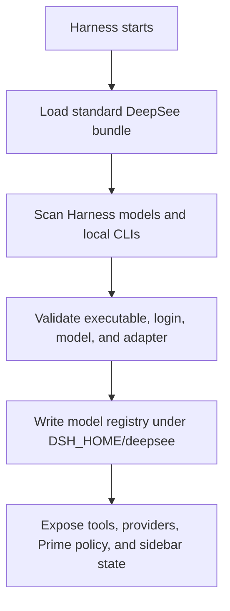
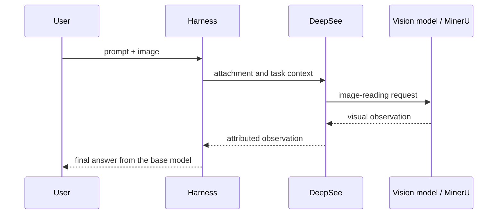

# DeepSee architecture

[简体中文](ARCHITECTURE.zh-CN.md) · [Back to README](../README.md)

DeepSee is an integration layer, not a replacement agent framework. It adds visual preprocessing, a truthful model registry, and capability-aware routing while leaving conversation state, providers, subagents, and Workflow execution in DeepSeek Harness.

## Design rules

1. **Harness remains the system of record.** Provider credentials and API model configuration belong to Harness.
2. **Only verified routes can execute.** Finding an executable is not enough; login, model selection, health, and an adapter must also pass.
3. **Visual work is explicit.** A text-only base model receives an observation from a real visual route and is never labelled as the image reader.
4. **Routing stays advisory.** Capability descriptions guide the main model; they are not a large hard-coded scheduling engine.
5. **One product surface.** Web configuration is mounted inside Harness instead of running a second dashboard or service.
6. **User state survives packages.** Mutable files live under `$DSH_HOME/deepsee`, outside npm and plugin package directories.

## Integration map

| Layer | Main files | Responsibility |
| --- | --- | --- |
| Bundle | `cordis.patch.yml` | Loads the Host plugin, Web client, and optional Codex provider in supported DSH profiles. |
| Host | `src/index.ts` | Installs tools, prompts, visual routing, provider mapping, Workflow command, and Prime policy. |
| Model registry | `src/model-registry.ts`, `scripts/registry-state.mjs` | Normalizes routes, preferences, status, and user-edited capability guidance. |
| Runtime discovery | `scripts/runtime-discovery.mjs`, `scripts/runtime-health.mjs` | Finds local CLIs and validates whether each route is usable. |
| Web UI | `host/client.js` | Renders the native sidebar panel, model matrix, visual preference, and update state. |
| Same-origin API | `host/admin-server.mjs` | Exposes `/api/deepsee` inside the Harness WebServer. |
| Visual adapters | `src/vision.ts`, `src/vision-adapter.ts`, `src/ocr.ts` | Selects a visual model or MinerU and returns an observation to the base model. |
| Subagent routing | `src/subagent-router.ts`, CLI provider modules | Maps a DeepSee route ID to a Harness provider/model or verified CLI adapter. |
| Installation | `scripts/install-plugin.mjs`, `scripts/folder-install.mjs` | Installs Web + Headless and supports durable ZIP staging. |
| Updates | `scripts/update-manager.mjs`, `scripts/update-policy.mjs`, `scripts/update-worker.mjs` | Checks, verifies, locks, and resumes user-approved upgrades. |

## Runtime flow

The public Web API removes executable paths and credential references before returning registry state to the client. The UI can edit allowed fields and preferences, but it cannot invent a provider or model identity.

## Visual request flow

The selected model must have `full-vision` status in the registry. OCR is selected separately through `visionMode`; MinerU is therefore not represented as a general chat model.

## Model registry and routing

The registry records identity, source, readiness, modality, capabilities, roles, and user overrides. Preferences include the primary route, visual route, visual mode, OCR tool, and Prime automatic-Workflow switch.

The routing contract is deliberately small:

- `opends_list_models` returns enabled and ready routes filtered by capability or role.
- A Workflow child can pass an exact DeepSee route ID as its `model` option.
- The `opends` worker maps that ID to the real Harness provider/model pair.
- CLI routes are handled by their dedicated provider only after validation.
- Missing, disabled, or stale route IDs fail loudly instead of silently falling back to an unrelated model.

`/workflow <task>` is the explicit path. Prime may choose Workflow only for multiple independent workstreams, clear cross-capability roles, or an approved plan marked `Execution mode: Workflow`. Automatic Prime orchestration is disabled when no ready full-vision route exists; explicit Workflow can still use ready text routes.

## State and secret boundaries

Default mutable state is rooted at `$DSH_HOME/deepsee` and includes the model registry, MinerU status and logs, staged ZIP packages, and update state. The generated Prime preset lives under `$DSH_HOME/.agent-presets/prime` because that is the Harness discovery location.

DeepSee does not copy raw provider secrets into the registry or return credential references to the browser. API keys remain managed by Harness. Legacy `OPENDS_BRIDGE_*` configuration can migrate provider metadata and a credential reference, not the secret value itself.

The Web profile mounts `/api/deepsee`. Headless has no WebServer, so it skips the management route while retaining discovery, routing, tools, providers, and policy.

## Installation and update safety

- Standard installation uses the supported Harness plugin command for both profiles.
- Repeated installs are resumable and skip a profile already containing the requested version.
- ZIP installation first stages a complete prebuilt package inside `DSH_HOME`, then installs from that durable path.
- Update resolution pins an exact official Git commit. If the GitHub API is unavailable, the official commits Atom feed is used to resolve the SHA.
- The updater verifies package identity, version, source, protocol compatibility, and prebuilt Host files before changing profiles.
- A cross-process lock prevents two Harness instances from upgrading the same installation concurrently.
- Checks are automatic and cached; installation always requires user confirmation.

## Adding a runtime

A new executable route is complete only when it has all of the following:

1. deterministic executable discovery;
2. version and login/credential health checks;
3. a real Harness subagent or CLI provider adapter;
4. model catalog selection where the CLI supports it;
5. registry serialization that excludes secrets and unsafe paths from public output;
6. failure tests for missing, logged-out, disabled, and unsupported states;
7. end-to-end verification in Web and Headless profiles.

Do not mark a discovery-only runtime as executable. For an API provider, prefer adding it through Harness native Models and implementing only the missing modality or routing metadata in DeepSee.

## Compatibility

The current release is tested against DeepSeek Harness `0.1.0-rc.6`. Peer dependencies accept compatible releases in the current `0.1.x` API line, while operational install/start commands use the exact runtime tested with the release. A future incompatible package layout must raise the update protocol or minimum-updater version so older clients fail closed and request a manual upgrade.

For implementation work, continue with [Contributing](../CONTRIBUTING.md).
