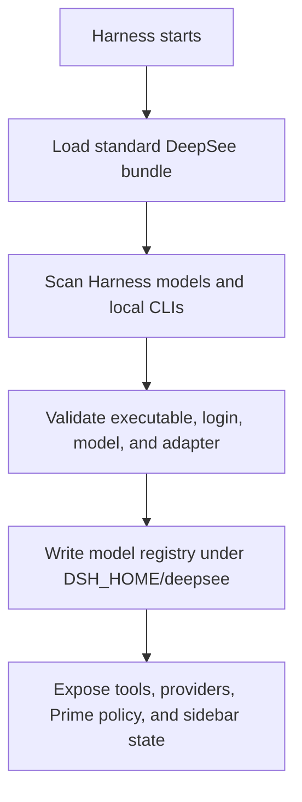
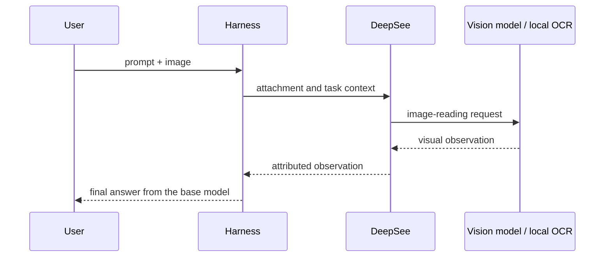

# DeepSee architecture

[简体中文](ARCHITECTURE.zh-CN.md) · [Back to README](../README.md)

DeepSee is an integration layer, not a replacement agent framework. It adds visual preprocessing, a truthful model registry, and capability-aware routing while leaving conversation state, providers, subagents, and Workflow execution in DeepSeek Harness.

## Design rules

1. **Harness remains the system of record.** Provider credentials and API model configuration belong to Harness.
2. **Only verified routes can execute.** Finding an executable is not enough; login, model selection, health, and an adapter must also pass.
3. **Visual work is explicit.** A text-only base model receives an observation from a real visual route and is never labelled as the image reader.
4. **Routing stays advisory.** Capability descriptions guide the main model; they are not a large hard-coded scheduling engine.
5. **One product surface.** Web configuration is mounted inside Harness instead of running a second dashboard or service.
6. **User state survives packages.** Mutable files live under `$DSH_HOME/deepsee`, outside npm and plugin package directories.

## Integration map

| Layer | Main files | Responsibility |
| --- | --- | --- |
| Bundle | `cordis.patch.yml` | Loads the Host plugin, Web client, and optional Codex provider in supported DSH profiles. |
| Host | `src/index.ts` | Installs tools, prompts, visual routing, provider mapping, Workflow command, and Prime policy. |
| Model registry | `src/model-registry.ts`, `scripts/registry-state.mjs` | Normalizes routes, preferences, status, and user-edited capability guidance. |
| Capability catalog | `scripts/model-capability-catalog.mjs` | Safely caches structured Models.dev modalities and degrades offline. |
| Runtime discovery and installation | `scripts/runtime-discovery.mjs`, `scripts/runtime-health.mjs`, `scripts/runtime-manager.mjs` | Finds local CLIs, owns isolated install paths, and validates whether each route is usable. |
| Global memory | `scripts/global-memory.mjs`, `src/cli-runtime-adapter.ts` | Imports Claude/Codex user instructions read-only and passes them to base sessions, CLI bases, direct routes, and Workflow children. |
| Web UI | `host/client.js` | Renders the native sidebar panel, model matrix, visual preference, and update state. |
| Same-origin API | `host/admin-server.mjs` | Exposes `/api/deepsee` inside the Harness WebServer. |
| Visual adapters | `src/vision.ts`, `src/vision-adapter.ts`, `src/ocr.ts` | Selects a visual model or managed OCR and returns an observation to the base model. |
| OCR management | `scripts/ocr-manager.mjs`, `scripts/ocr-runner.py` | Isolates install, validation, normalized output, and safe removal for MinerU, PaddleOCR, and RapidOCR. |
| Subagent routing | `src/subagent-router.ts`, CLI provider modules | Maps a DeepSee route ID to a Harness provider/model or verified CLI adapter. |
| Installation | `scripts/install-plugin.mjs`, `scripts/folder-install.mjs` | Installs Web + Headless and supports durable ZIP staging. |
| Updates | `scripts/update-manager.mjs`, `scripts/update-policy.mjs`, `scripts/update-worker.mjs` | Checks, verifies, locks, and resumes user-approved upgrades. |

## Runtime flow

The public Web API removes executable paths and credential references before returning registry state to the client. The UI can edit allowed fields and preferences, but it cannot invent a provider or model identity.

## Visual request flow

The selected model must have `full-vision` status in the registry. OCR is selected separately through `visionMode` and `ocrTool`; MinerU, PaddleOCR, and RapidOCR are therefore never represented as general chat models. Each engine has an isolated directory. A small Python runner normalizes recognized text before the Host wraps it as an untrusted visual observation.

## Model registry and routing

The registry records identity, source, readiness, modality, capabilities, roles, and user overrides. Preferences include the primary route, visual route, visual mode, OCR tool, and Prime automatic-Workflow switch.

The routing contract is deliberately small:

- `opends_list_models` returns enabled and ready routes filtered by capability or role.
- A Workflow child can pass an exact DeepSee route ID as its `model` option.
- The `opends` worker maps that ID to the real Harness provider/model pair.
- A verified CLI Runtime creates one initial route. Additional user-selected models are stored as sibling routes with stable IDs and the same `cliRuntimeId`; each route keeps its own enabled state and capability profile.
- CLI routes are handled by their dedicated provider only after validation, so sibling Sonnet/Opus/Fable, Codex variants, or Gemini Auto/Pro/Flash routes can run concurrently in one Workflow.
- Missing, disabled, or stale route IDs fail loudly instead of silently falling back to an unrelated model.

`/workflow <task>` is the guaranteed explicit path. With automatic Workflow enabled, Prime uses a balanced policy: prefer Workflow for two or more genuinely independent workstreams, multiple deliverables or capability roles, implementation plus independent review, explicit model/approach comparison, or an approved plan marked `Execution mode: Workflow`. Comparison and review use different suitable routes when at least two are ready, with the main model synthesizing disagreements. Missing vision limits image work but no longer disables text, code, research, or document Workflows.

## Workflow execution trace

DeepSee does not create a second Workflow engine. The Web client extends the native Harness `workflow-run` node, while Harness events remain authoritative for phases, members, state, and persistence. The plugin only adds public Runtime progress and deliverables for CLI and desktop-subscription routes.

- Codex App Server plan updates, reasoning summaries, public progress, tool actions, and file changes become trace events.
- Claude Code public text, tool actions, and final output become trace events; private `thinking` blocks are never forwarded.
- A Runtime without streaming events still records lifecycle, final summary, and discoverable output paths.
- The bounded store is `$DSH_HOME/deepsee/execution-traces.json`.
- Only allowlisted files inside the active workspace can be previewed through same-origin `/api/deepsee/v1/artifacts`; outside paths are rejected.

The UI renders concise plan/progress/action/result entries and keeps raw commands as hover details. This is a view of provider-exposed summaries and actions, not a promise or attempt to reveal private chain of thought.

## State and secret boundaries

Default mutable state is rooted at `$DSH_HOME/deepsee` and includes the model registry, OCR status and logs, staged ZIP packages, and update state. Managed OCR Python environments and model caches use isolated app-data directories; uninstall removes only allowlisted children. The generated Prime preset lives under `$DSH_HOME/.agent-presets/prime` because that is the Harness discovery location.

DeepSee does not accept, read, or copy raw provider secrets and never returns credential references to the browser. API keys are owned exclusively by Harness. The legacy plaintext connection endpoint now returns `410 native_harness_credentials_required`, and legacy files no longer participate in routing. To avoid silently destroying credentials during an upgrade, plaintext fields and stale API routes are removed only after the user explicitly runs `deepsee doctor --scrub-legacy-secrets`.

## Plugin-group boundary

The release unit is the atomic `deepsee-suite` plugin group: `deepsee-core`, `deepsee-codex`, `deepsee-client`, and `deepsee-workflow-policy`. Normal install and uninstall operate on the complete group so a profile cannot retain half of the product, while subpath exports let another plugin reuse one component. Uninstall removes package registrations and only a Prime preset carrying DeepSee's ownership marker; it preserves `$DSH_HOME/deepsee` user state and managed OCR installations.

Workflow cost control is a soft policy. Plans declare a Focused, Balanced, or Deep reasoning profile and reduce waste through narrow roles, targeted context, compact checkpoints, and artifact reuse. No runtime, token, step, or agent hard cutoff is imposed, so productive long work is not terminated immediately before delivery.

Harness continues to own project-level `AGENTS.md`, `CLAUDE.md`, and `agent.md` loading. DeepSee additionally checks conventional files in the user directory, `.claude`, and `.codex`, deduplicates and size-bounds them, and installs the result in the system prompt. Codex/Claude subscription base models and Workflow children receive the same inherited memory. `$DSH_HOME/AGENTS.md` is reported as a Harness-native source and is not injected twice. Browser state receives only file names, sources, sizes, and truncation status—never text or absolute paths.

The Web profile mounts `/api/deepsee`. Headless has no WebServer, so it skips the management route while retaining discovery, routing, tools, providers, and policy.

## Installation and update safety

- Standard installation uses the supported Harness plugin command for both profiles.
- Repeated installs are resumable and skip a profile already containing the requested version.
- ZIP installation first stages a complete prebuilt package inside `DSH_HOME`, then installs from that durable path.
- Update resolution pins an exact official Git commit. If the GitHub API is unavailable, the official commits Atom feed is used to resolve the SHA.
- The updater verifies package identity, version, source, protocol compatibility, and prebuilt Host files before changing profiles.
- A cross-process lock prevents two Harness instances from upgrading the same installation concurrently.
- Checks are automatic and cached; installation always requires user confirmation.

## Adding a runtime

A new executable route is complete only when it has all of the following:

1. deterministic executable discovery;
2. version and login/credential health checks;
3. a real Harness subagent or CLI provider adapter;
4. model catalog selection where the CLI supports it;
5. registry serialization that excludes secrets and unsafe paths from public output;
6. failure tests for missing, logged-out, disabled, and unsupported states;
7. end-to-end verification in Web and Headless profiles.

Do not mark a discovery-only runtime as executable. For an API provider, prefer adding it through Harness native Models and implementing only the missing modality or routing metadata in DeepSee.

## Compatibility

The current release is tested against DeepSeek Harness `0.1.0-rc.6`. Peer dependencies accept compatible releases in the current `0.1.x` API line, while operational install/start commands use the exact runtime tested with the release. A future incompatible package layout must raise the update protocol or minimum-updater version so older clients fail closed and request a manual upgrade.

For implementation work, continue with [Contributing](../CONTRIBUTING.md).
