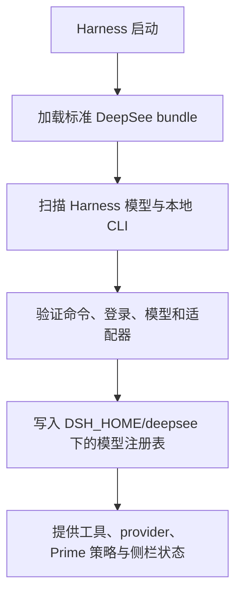
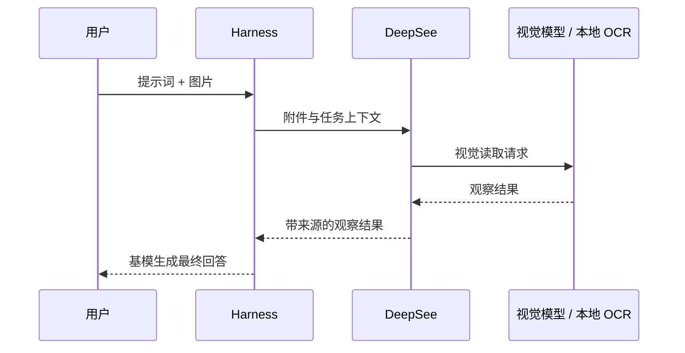

# DeepSee 架构说明

[English](ARCHITECTURE.md) · [返回 README](../README.zh-CN.md)

DeepSee 是集成层，不是另一套 Agent 框架。它补充视觉预处理、可信的模型注册表和能力路由；对话状态、供应商、子 Agent 与 Workflow 执行仍由 DeepSeek Harness 负责。

## 设计原则

1. **Harness 是唯一配置来源。** API 模型与供应商凭据归 Harness 管理。
2. **只有验证过的路线才能执行。** 找到命令还不够，登录、模型、健康状态与适配器也必须通过。
3. **视觉执行者必须明确。** 纯文本基模接收真实视觉路线的观察结果，不会被标成图片读取者。
4. **路由保持轻量。** 能力描述用于帮助主模型判断，而不是建立庞大的硬编码调度系统。
5. **只有一个产品界面。** Web 配置挂在 Harness 内部，不运行第二个面板或伴随服务。
6. **用户状态与包分离。** 可变文件位于 `$DSH_HOME/deepsee`，不写入 npm 或插件包目录。

## 集成结构

| 层 | 主要文件 | 职责 |
| --- | --- | --- |
| Bundle | `cordis.patch.yml` | 在受支持的 DSH profile 中加载 Host、Web 客户端和可选 Codex provider。 |
| Host | `src/index.ts` | 安装工具、提示、视觉路由、provider 映射、Workflow 命令与 Prime 策略。 |
| 模型注册表 | `src/model-registry.ts`、`scripts/registry-state.mjs` | 规范化路线、首选项、状态和用户修正的能力描述。 |
| 能力目录 | `scripts/model-capability-catalog.mjs` | 安全缓存 Models.dev 结构化模态，并在离线时降级。 |
| Runtime 扫描与安装 | `scripts/runtime-discovery.mjs`、`scripts/runtime-health.mjs`、`scripts/runtime-manager.mjs` | 发现本地 CLI，管理隔离安装路径，并验证每条路线能否使用。 |
| 全局记忆 | `scripts/global-memory.mjs`、`src/cli-runtime-adapter.ts` | 只读导入 Claude/Codex 用户指令，并传给主会话、CLI 基模、直接调用和 Workflow 子任务。 |
| Web UI | `host/client.js` | 渲染原生侧栏、模型矩阵、视觉首选项和升级状态。 |
| 同源接口 | `host/admin-server.mjs` | 在 Harness WebServer 中提供 `/api/deepsee`。 |
| 视觉适配 | `src/vision.ts`、`src/vision-adapter.ts`、`src/ocr.ts` | 选择视觉模型或受管 OCR，把观察结果交回基模。 |
| OCR 管理 | `scripts/ocr-manager.mjs`、`scripts/ocr-runner.py` | 隔离安装、验证、统一输出与安全卸载 MinerU、PaddleOCR、RapidOCR。 |
| 子 Agent 路由 | `src/subagent-router.ts` 与 CLI provider | 把 DeepSee route id 映射为 Harness provider/model 或已验证的 CLI。 |
| 安装 | `scripts/install-plugin.mjs`、`scripts/folder-install.mjs` | 安装 Web + Headless，并支持 ZIP 持久化兜底。 |
| 升级 | `scripts/update-manager.mjs`、`scripts/update-policy.mjs`、`scripts/update-worker.mjs` | 检查、验证、加锁并续跑用户确认的升级。 |

## 启动流程

Web 接口在返回注册表前会移除可执行路径与凭据引用。界面可以修改允许的字段与首选项，但不能凭空造出供应商或模型身份。

## 视觉请求流程

被选中的模型必须在注册表中达到 `full-vision`。OCR 由独立的 `visionMode` 与 `ocrTool` 选择，所以 MinerU、PaddleOCR 和 RapidOCR 都不会被表示为通用聊天模型。三个引擎分别使用隔离目录；统一 Python runner 只输出已识别文字，Host 再把它包装成不受信任的视觉观察。

## 模型注册表与路由

注册表记录模型身份、来源、就绪状态、模态、能力、角色与用户修正。首选项包括主模型路线、视觉路线、视觉模式、OCR 工具与 Prime 自动 Workflow 开关。

路由协议刻意保持简单：

- `opends_list_models` 按能力或角色返回已经打开且就绪的路线。
- Workflow 子任务可把精确的 DeepSee route id 作为 `model` 参数。
- `opends` worker 将该 id 映射到真实的 Harness provider/model。
- 一个验证通过的 CLI Runtime 初始只创建一条路线；用户追加的模型会保存为具有稳定 id、共享同一 `cliRuntimeId` 的并列路线，每条路线分别保存开关与能力画像。
- CLI 路线只有通过验证后，才交给专用 provider 执行，因此同一个 Workflow 可以同时调用 Sonnet、Opus、Fable、不同 Codex 档位或 Gemini Auto/Pro/Flash 路线。
- 路线不存在、被关闭或已经过期时明确失败，不会暗中换成无关模型。

`/workflow <任务>` 是显式入口。Prime 只在存在多条独立工作流、清晰的跨能力角色，或已经批准并标记 `Execution mode: Workflow` 的计划时自动选择 Workflow。没有就绪的完整视觉路线时，Prime 自动编排会被关闭；显式 Workflow 仍可使用就绪的文本路线。

## 状态与密钥边界

默认可变状态位于 `$DSH_HOME/deepsee`，包括模型注册表、OCR 状态和日志、暂存的 ZIP 包与升级状态。受管 OCR 的 Python 环境与模型缓存位于独立的应用数据目录，卸载时只删除白名单子目录。生成的 Prime preset 位于 `$DSH_HOME/.agent-presets/prime`，因为这里是 Harness 的发现目录。

DeepSee 不会把原始供应商密钥复制到注册表，也不会把凭据引用返回浏览器。API Key 仍由 Harness 管理。旧 `OPENDS_BRIDGE_*` 配置迁移时只迁移供应商元数据与凭据引用，不迁移密钥值。

工作区内的 `AGENTS.md`、`CLAUDE.md` 与 `agent.md` 仍由 Harness 原生指令加载器负责。DeepSee 额外只读检查用户目录、`.claude` 和 `.codex` 中的同名全局文件，将去重且受大小限制的内容放入 system prompt；Codex/Claude 订阅基模与 Workflow 子任务走同一继承链。`$DSH_HOME/AGENTS.md` 只显示为 Harness 原生来源，不会被 DeepSee 重复注入。浏览器接口只得到文件名、来源、大小与截断状态，不得到正文或绝对路径。

Web profile 会挂载 `/api/deepsee`。Headless 没有 WebServer，因此跳过管理接口，但保留扫描、路由、工具、provider 与策略。

## 安装与升级安全

- 标准安装通过受支持的 Harness 插件命令写入两个 profile。
- 重复安装可以续跑，并跳过已经是目标版本的 profile。
- ZIP 安装先把完整预构建包存入 `DSH_HOME`，再从持久路径安装。
- 升级解析会锁定官方仓库的精确 Git commit；GitHub API 不可用时，用官方 commits Atom feed 取得 SHA。
- 修改 profile 前会验证包名、版本、来源、升级协议和预构建 Host 文件。
- 跨进程锁阻止多个 Harness 实例同时升级同一安装。
- 检查会自动缓存，但安装一定由用户确认。

## 增加新的 Runtime

一条新的可执行路线至少需要：

1. 可重复的命令发现逻辑；
2. 版本与登录/凭据健康检查；
3. 真实可用的 Harness 子 Agent 或 CLI provider 适配器；
4. CLI 支持时提供模型目录选择；
5. 注册表序列化时不向浏览器暴露密钥与危险路径；
6. 覆盖缺失、未登录、关闭和不支持状态的失败测试；
7. Web 与 Headless 的端到端验证。

不要把只能发现的 Runtime 标成可执行。增加 API 供应商时，应优先使用 Harness 原生模型设置，只在 DeepSee 中补齐缺失的模态或路由元数据。

## 兼容策略

当前版本以 DeepSeek Harness `0.1.0-rc.6` 为实测目标。Peer 依赖允许当前 `0.1.x` API 系列中的兼容版本，但安装与启动命令使用当前发行版验证过的精确 Runtime。未来包结构若不兼容，必须提高升级协议或最低更新器版本，让旧客户端安全停止并提示手动升级。

准备修改实现时，请继续阅读[参与开发](../CONTRIBUTING.zh-CN.md)。
